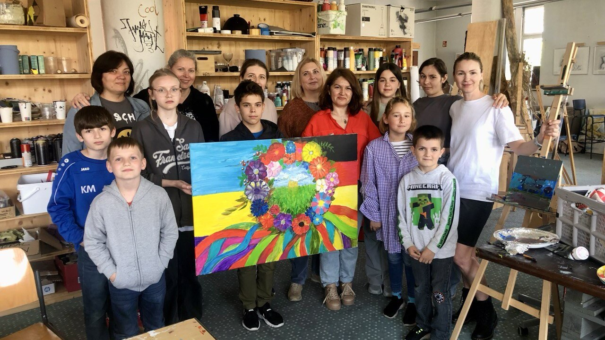

---
---

    


Ми тільки починаємо будівництво сайту. Заходь пізніше! 🚀


У січні 2025 року ініціативна група українських та німецьких культурних діячів створили Українсько-німецьку спілку «Оберіг» (Ukrainisch-deutscher Verein „Oberig“) для того, щоб об’єднати на одній платформі креативні культурно-освітні проєкти. 

Створення спілки стало логічним продовженням та масштабованням  діяльності «Kreativ Klub Hanau», який з 2022 року об’єднує українських дітей на грунті творчості.

Назву обрано не випадково.  За давньою українською традицією, оберіг - це те, що береже людину, приносить щастя, допомагає їй уникнути неприємностей, захиститися від зла, вистояти проти ворогів та зберегти власну ідентичність.

[Дізнатися більше]()
