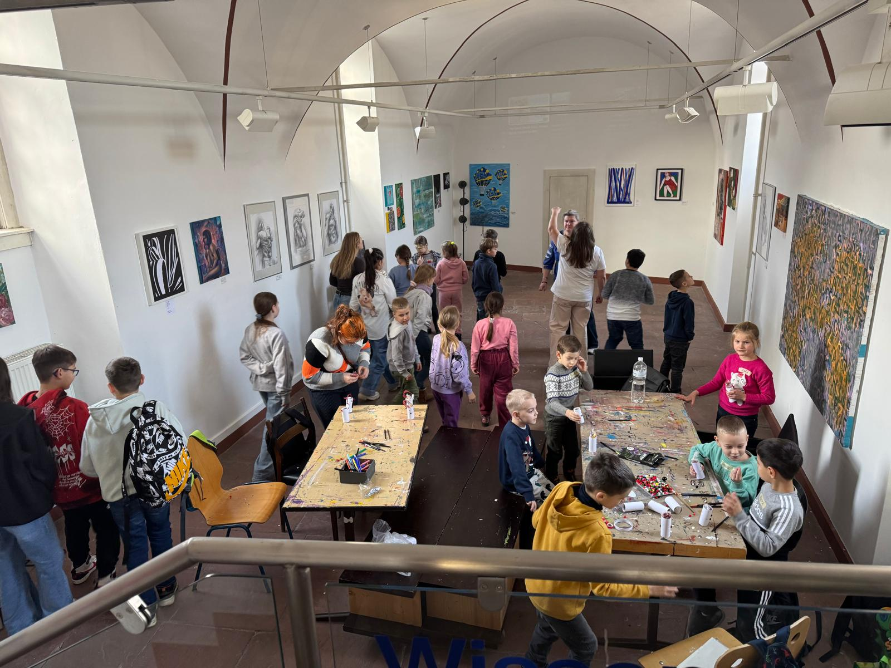
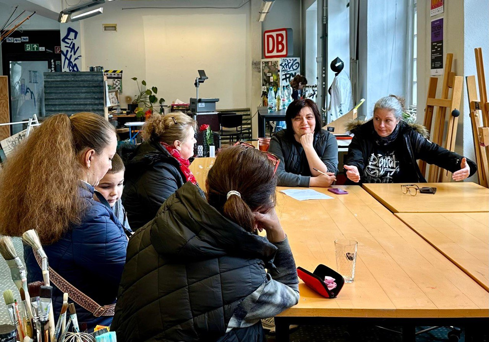
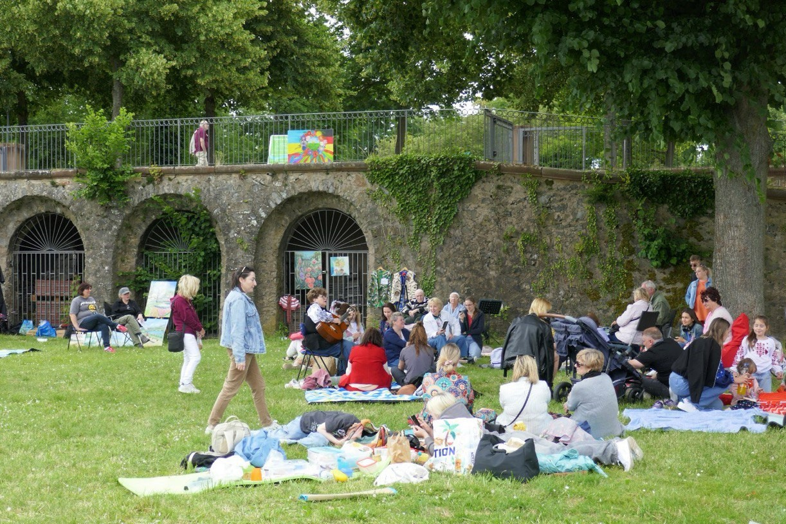

---
title: "Entwicklung"
date: "2025-02-23T18:34:26+01:00"
---

Wir sind bestrebt, unser Projekt auszubauen.

Wir haben bereits Anfragen von Eltern erhalten, die unsere Aktivitäten ausweiten möchten, und sind dabei, die Zahl der Freiwilligen zu erhöhen, die bereit sind, in den folgenden Bereichen zu arbeiten:

Erlernen der ukrainischen und deutschen Sprache, Kultur, Geschichte, Musik und Traditionen durch Kreativität und nicht-formales Lernen.

Ein thematisches Sprach- und Sozial- Café für verschiedene Altersgruppen (um Menschen nach Alter, Hobbys und Interessen zusammenzubringen).

Anpassung und Integration von Kindern und Erwachsenen in die deutsche Gesellschaft durch deutsch-ukrainischen Kulturaustausch, der Kindern und Erwachsenen neue Entwicklungsmöglichkeiten eröffnet.

