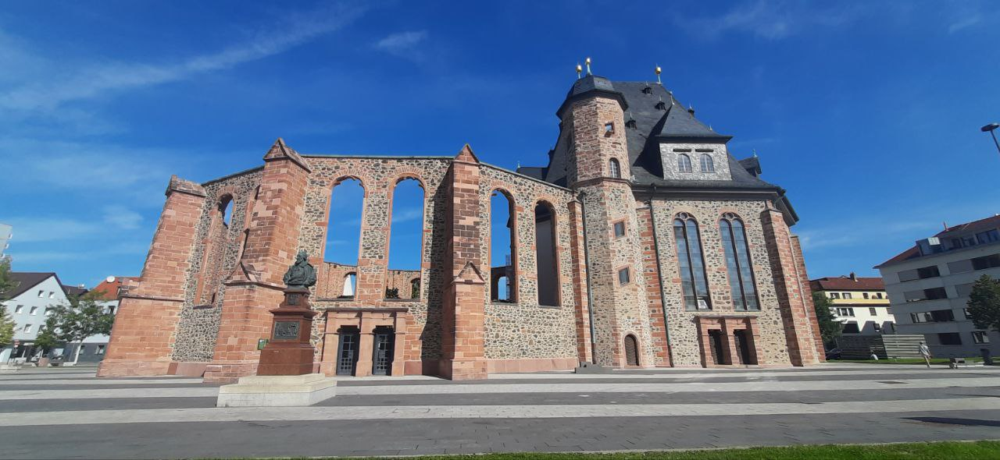
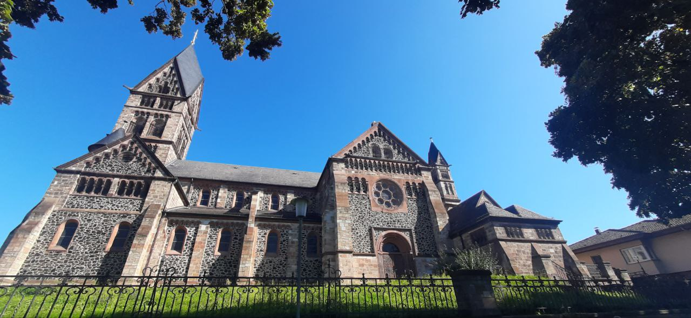
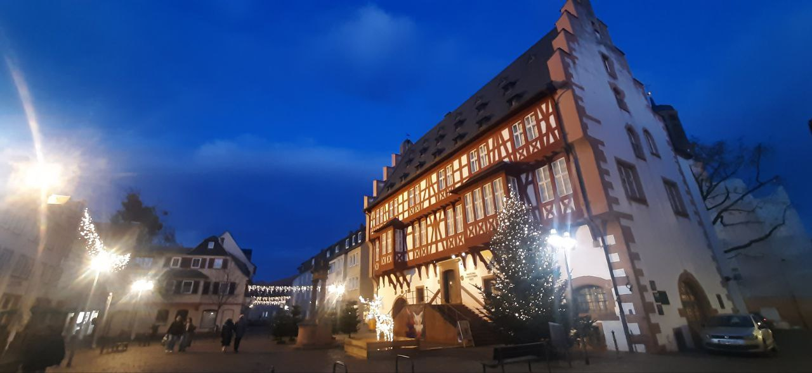
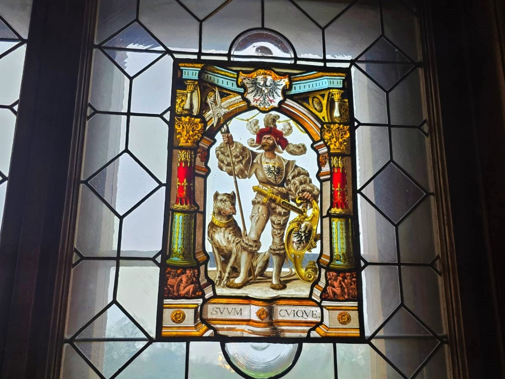
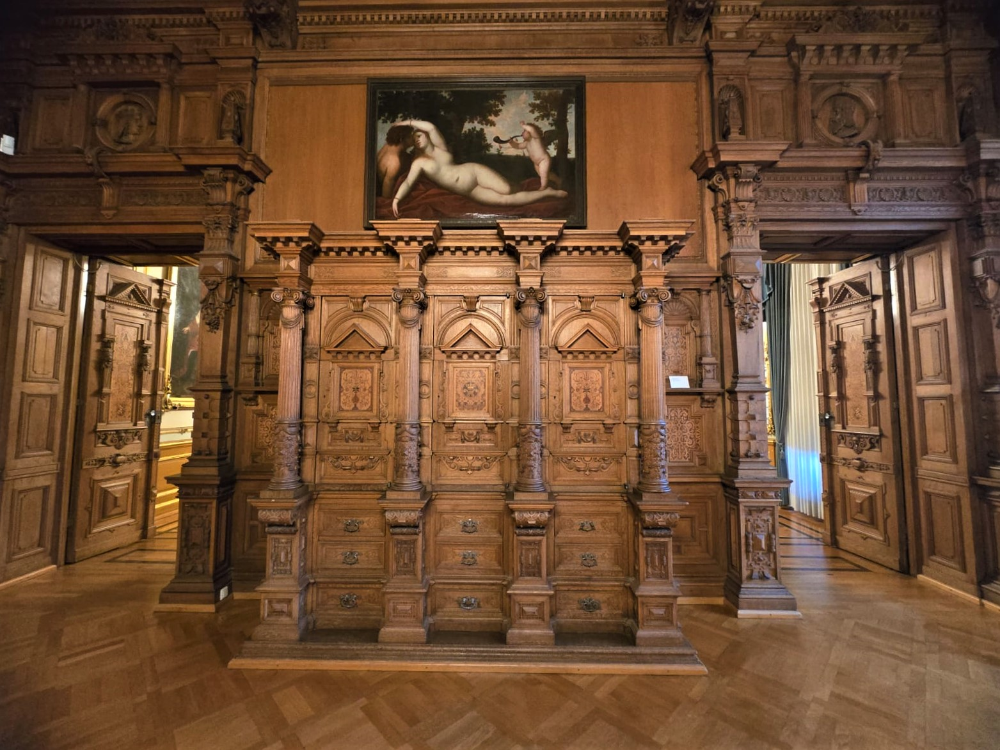
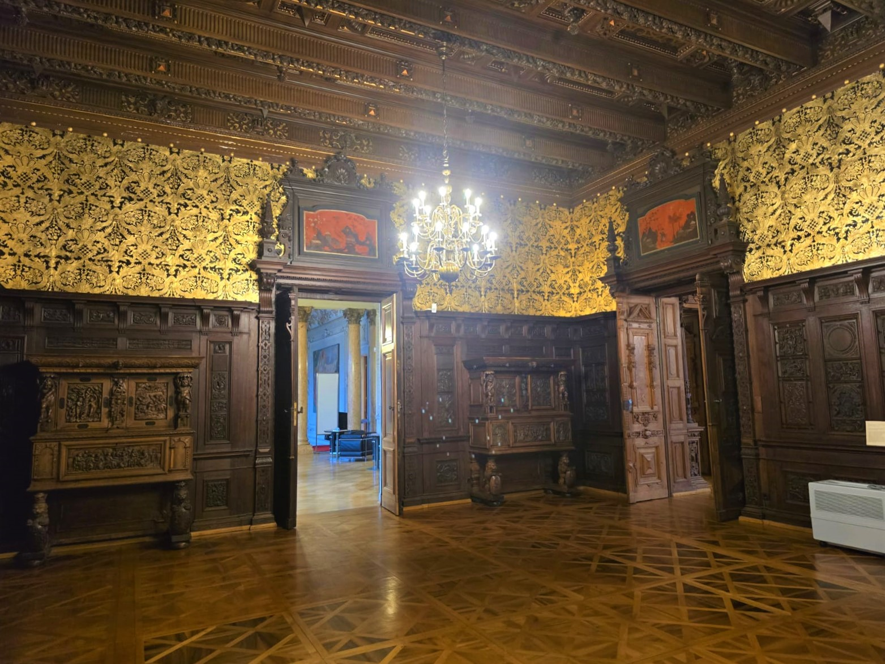
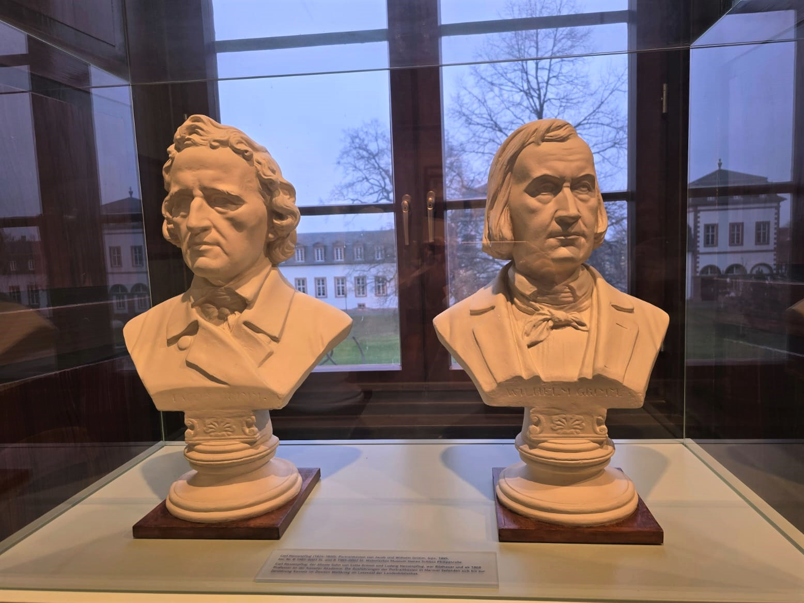

Ми прагнемо відкрити Німеччину для українців, а українську культуру для Німеччини. Зокрема – великий потенціал вбачаємо в багатій історичній та культурній спадщині землі Гессен.

Організація пізнавальних тематичних екскурсій українською та німецькою мовами, відвідування музеїв, цікавих місць, пам’яток архітектури та історії,  культурних подій тощо.

> Ми зацікавлені у співпраці з муніципальними музеями на постійній основі. Готові розробити спільну освітню програму для різних цільових груп та груп відвідувачів, щоб відвідувати постійні та тимчасові експозиції, з урахуванням тематики відповідного музею.

Проведення тематичних свят,  днів національної кухні (майстер класи з приготування блюд, пригощання смаколиками, пікніки на природі, дні народження та дитячі святоа тощо).

 

Для реалізації нашої програми плануємо налагодити співпрацю з культурними установами та центрами підтримки мігрантів землі Гессен.

 

