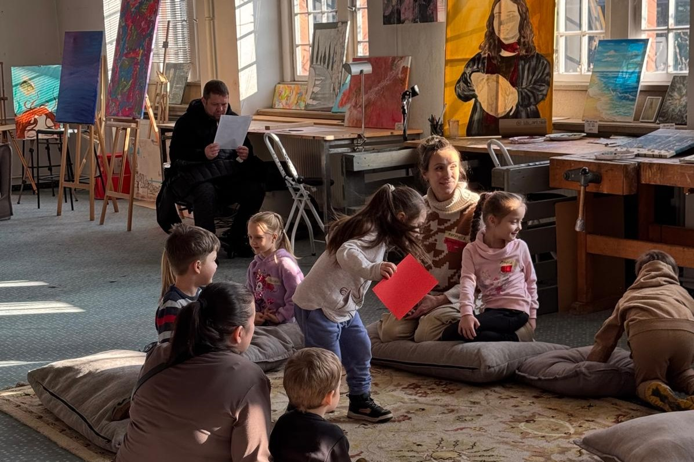
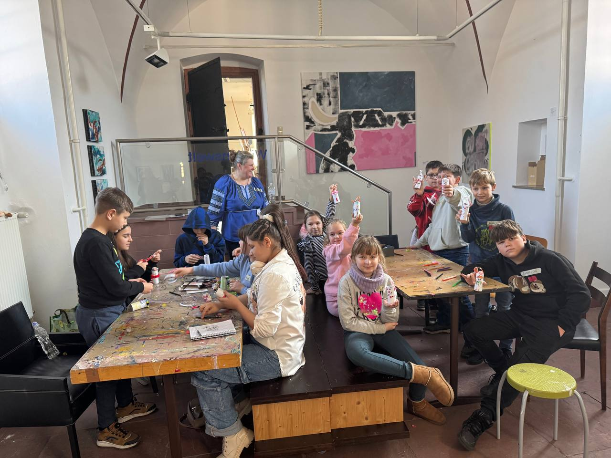
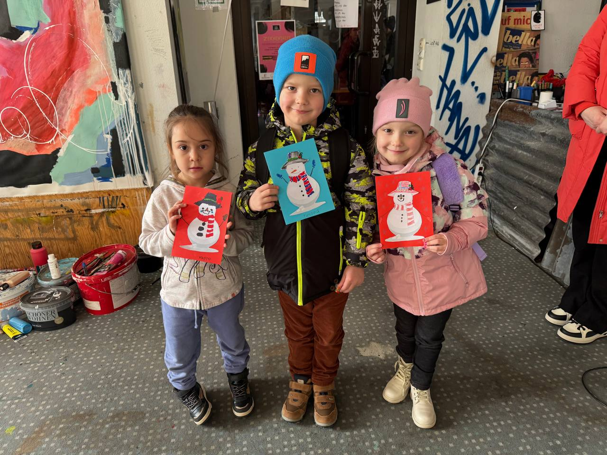

**Unser Bildungsprojekt läuft im Testbetrieb seit Januar 2025.**

Jeden Samstag von 10:00 bis 15:00 Uhr lernen die Kinder Ukrainisch und Deutsch und gestalten unter Anleitung von Lehrern Kunst. Die Treffen finden im Zentrum von Hanau statt.

Derzeit sind etwa 40 Kinder für die ukrainische Samstagsschule angemeldet und und die Zahl der Anmeldungen steigt.

Wir haben 3 Altersgruppen:

- 4 - 5 Jahre alt
- 6 - 8 Jahre alt 
- 9 - 13 Jahre alt

Es ist geplant, 2 Gruppen im Alter 14 -  16 und 16 -  18 Jahren zu organisieren.

> Erfahrene Fachkräfte arbeiten mit den Kindern auf freiwilliger Basisund führen sie durch informelles Lernen, Spiele, Singen und Kommunikation in ihrer Muttersprache und in Deutsch an die ukrainische Sprache und Traditionen heran.

